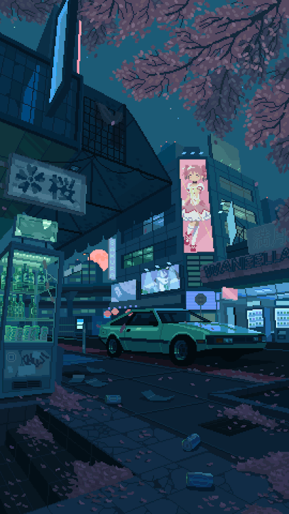

    

    

  
  

<pre>
    🔭 I’m currently working on Nekoyomi, 
    an offline Anime + streaming "wrapper" 
    -focused on ease of use for iOS
    🌱 I’m currently learning back-end dev
    👯 I’m looking to collaborate on any projects💖
    🎮 Music • Games • Anime • Code • Art
</pre>
  

   
    

